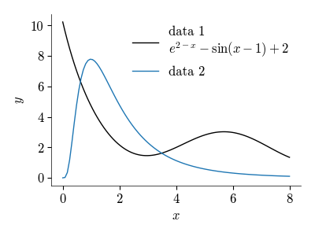
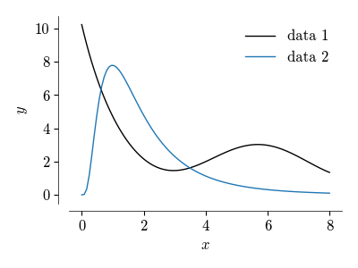

``matplotlib-tufte`` -- styles from Tufte's "Visual Display Of Quantitative Information" for ``matplotlib``
===========================================================================================================

``matplotlib-tufte`` styles figures to make them easier on the eyes, and keep only essential ink.

Based on : Tufte, Edward. `The Visual Display of Quantitative Information`. 2nd ed., Graphics Press, 2007.

Installation
------------

::

	python -m pip install "matplotlib_tufte @ git+https://github.com/ninivert/matplotlib_tufte.git"

Usage
-----

``setup`` tries to load the Latin Modern Roman font (comes packaged with ``matplotlib_tufte``) and the ``tufte.mplstyle`` stylesheet.

Changes made by the custom style :

- better readability using a serif font
- Latin Modern Roman font
	- applied to all text (ticks, labels, legends, titles, etc.)
	- in math mode, gives LaTeX-like math results, without needing a LaTeX installation
- smaller figures (increase data density)
	- figsize is defaulted to (4, 3)
	- tight layout applied automatically
- thinner axes to put emphasis on data ink
- remove chartjunk and non-data ink
	- remove top and right spines
	- remove legend fancybox and frame
- insert black as the first color of the cycler

::

	Documentation for ``breathe``

	Add some space between the axes and the spines

	Parameters
	----------
	ax : matplotlib.axes.Axes
	which : str or AxisWhich, optional
		which axis to apply the spacing on, by default AxisWhich.BOTH
	pad_frac_start : float, optional
		space to add to the start of the axis, as a fraction of the data span, by default 0.04
	pad_frac_end : float, optional
		space to add to the end of the axis, as a fraction of the data span, by default 0.04

::

	Documentation for ``data_lim``

	Sets the axis to use the limits of the data

	Parameters
	----------
	ax : matplotlib.axes.Axes
	which : str or AxisWhich, optional
		which axis to apply the spacing on, by default AxisWhich.BOTH

In other cases, you might just need to get your hands dirty, using methods such as

- ``ax.spines.bottom.set_visible(False)`` to disable the bottom line
- ``ax.set_xticks(...)`` and ``ax.set_xticklabels(...)`` to customize ticks
- ``ax.set_xlim(...)`` and ``ax.set_xticklabels(...)`` to have nice integer limits. Use this in combination with ``breathe`` if you were used to matplotlib adding padding to the limits

Examples
--------

`See also the demo notebook <demo/demo.ipynb>`_

::

	from matplotlib_tufte import *
	setup()
	import matplotlib.pyplot as plt
	import matplotlib as mpl
	import numpy as np

	x = np.linspace(1, 9, 100)
	y1 = np.exp(-(x-2)) - np.sin(x-1) + 2
	y2 = 5 * 2/x * np.exp(-(np.log(x-0.99)-0.5)**2)

	plt.close('all')
	fig, ax = plt.subplots()
	ax.set_xlabel('$x$')
	ax.set_ylabel('$y$')
	ax.plot(x, y1, label='data 1')
	ax.plot(x, y2, label='data 2')
	ax.legend()
	plt.show()
	fig.savefig('fig1.png')

Letting the axis breathe

::

	breathe(ax)

Setting data limits

::

	data_lim(ax)

Getting your hands dirty

::

	np.random.seed(0)
	N = 50
	sample1 = np.random.lognormal(0.9, 0.5, N)
	sample2 = np.random.lognormal(0.2, 0.7, N)

	means = [np.mean(sample1), np.mean(sample2)]
	stds = [np.std(sample1) * np.sqrt(N/(N-1)), np.std(sample2) * np.sqrt(N/(N-1))]  # sample stdev
	x = [0, 1]

	fig, ax = plt.subplots(figsize=(2, 3))
	for x_, sample, m, s in zip(x, (sample1, sample2), means, stds):
		ax.plot([x_]*len(sample), sample, linestyle='', marker='_', color='k')
		ax.hlines(np.mean(sample), x_-0.3, x_+0.3, linewidth=0.5, color='k')
		ax.add_patch(mpl.patches.FancyArrowPatch(
			arrowstyle='|-|,widthA=2.0,widthB=2.0',
			linewidth=0.5,
			path=mpl.path.Path([(x_-0.3, m-s), (x_-0.3, m+s)]))
		)
	ax.set_xticks(x)
	ax.set_xticklabels(['S1', 'S2'])
	ax.set_xlim((-1, 2))
	ax.set_ylim((0, 8))
	ax.set_ylabel('measurement')
	breathe(ax, 'y')
	ax.spines.bottom.set_visible(False)
	plt.show()

.. image:: demo/fig5.png

TODO
----

- Range frames
- Data ticks
- Axis histograms